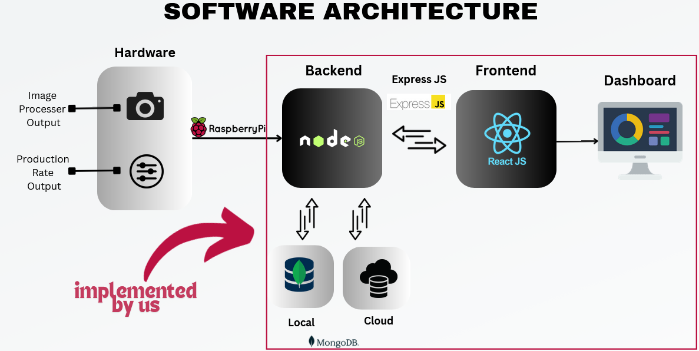
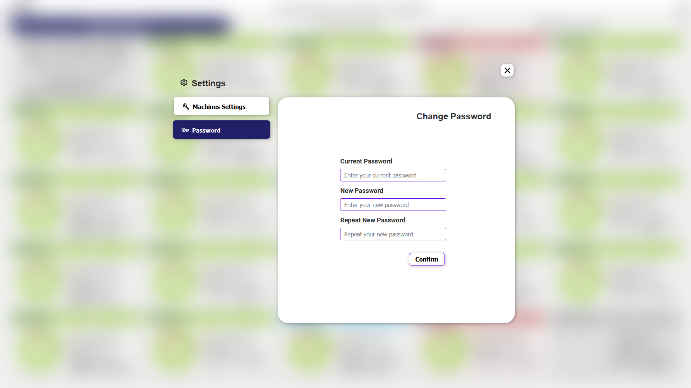

[comment]: # "This is the standard layout for the project, but you can clean this and use your own template"

# **MONA Dashboard**

---

<!--
This is a sample image, to show how to add images to your page. To learn more options, please refer [this](https://projects.ce.pdn.ac.lk/docs/faq/how-to-add-an-image/)
 -->

## Table of Contents

1. [Introduction](#introduction)
2. [Overview](#overview)
3. [Key Features](#key-features)
4. [Software Architecture](#software-architecture)
5. [Team](#team)
6. [Links](#links)

---
## **Introduction**

The Mona Dashboard project addresses the production challenges of factories manufacturing plastic toys using molds. In such operations, one of the most common problems is parts getting stuck in the molds, which disrupts production and impacts efficiency. This challenge becomes even more critical when managing 24 machines producing 10 different types of products.

To address this challenge, we have developed a complete real-time production monitoring system. The system will provide live updates on machine performance, send emergency alerts in cases of issues such as stuck parts, and maintain a historical record of production data. It allows operators to quickly react to production issues, minimizing line downtime and increasing overall productivity. This dashboard is an important step in optimizing production processes for smoother operations in the factory.

## **Overview**

Our project focuses on developing an advanced real-time monitoring dashboard tailored for a production environment. This dashboard aims to enhance the efficiency and reliability of production processes by providing critical insights and timely alerts. Our system is designed with user-friendliness, ensuring that operators and managers can easily access and interpret the data they need to maintain optimal production performance.
The dashboard is a centralized interface designed to provide real-time insights into machine performance and production progress, along with tools for managing settings and reviewing historical data. It is divided into the following key tabs:

## **Key Features**

#### Real-Time Monitoring of Mold Machines:
The Machine Status tab serves as the heart of the dashboard, where users can:
+ **Monitor Real-Time Machine Performance**: It shows the current state of all 24 machines, enabling quick identification of any issues or inefficiencies.
+ **Visual Status Indicators**: Machines are color-coded (Green, Red, Blue, Gray) to reflect their operational state at a glance:
+ **Green (Active)**: Machines are running smoothly and contributing to production.
+ **Red (Emergency)**: Machines have encountered an issue, such as a blockage, and need immediate attention.
+ **Blue (Idle)**: Machines are powered on but are not actively producing.
+ **Gray (Off)**: Machines are completely powered down.
+ **Comprehensive Machine Metrics**: Key performance metrics are displayed for each machine, such as the number of slots successfully completed, failures, and the percentage of target achieved.

#### Production Progress Monitoring:
This tab focuses on visualizing production efficiency and tracking output:
+ **Production Rates**: Provides detailed metrics on the production of toy parts or complete toys over time.
+ **Performance Trends**: Graphical visualizations (e.g., line charts or bar graphs) make it easy to identify patterns or bottlenecks in the production process.
+ **Goal Monitoring**: Displays how close each machine or the entire production line is to meeting its targets.

#### Historical Production Data:
The Production History tab acts as an archive, storing and organizing data from previous production runs:
+ **Historical Insights**: Users can access data from past shifts, weeks, or months to analyze performance trends.
+ **Detailed Records**: Includes specifics such as total production, success and failure rates, and machine activity logs.
+ **Decision-Making Support**: Historical data helps identify patterns, allowing for more informed decisions about machine usage, maintenance schedules, and productivity strategies.

#### Settings:
The Settings page is a utility tab for administrative and configuration purposes:
+ **Machine Management**: Administrators can update machine names, assign production tasks, and adjust target goals for machines.
+ **User Security**: Includes options for resetting passwords to maintain system security and ensure that only authorized personnel have access to critical dashboard features.
+ **System Customization**: Users may be able to tweak preferences, such as notifications or report frequency, depending on the system's configuration.

## **Software Architecture**

## **Dashboard Views**

#### ***Machine Status Page View***

#### **Expanding the Dashboard Views**

***Active Machine Status***-
Machine is working perfectly!

***Emergency Machine Status***-
There is a stuck particle in the machine.

***Inactive Machine Status***-
Machine is OFF.

***Idle Machine Status***-
Machine is ON but not making products.

#### ***Production Rate Page View***

#### ***Production Summary Page View***

#### ***Setting Page View***

User can change the password and machine details by verifying the password as desired.

## **Team**

- E/20/361, Yohan Senadheera, [e20361@eng.pdn.ac.lk](mailto:e20361@eng.pdn.ac.lk)
- E/20/378, Amanda Siriwardhane, [e20378@eng.pdn.ac.lk](mailto:e20378@eng.pdn.ac.lk)
- E/20/366, Bhagya Senevirathna, [e20366@eng.pdn.ac.lk](mailto:e20366@eng.pdn.ac.lk)
- E/20/024, Buddhika Ariyarathna , [e20024@engdn.ac.lk](mailto:e20024@eng.pdn.ac.lk)
- E/20/089, Yasiru Harinda, [e20089@engdn.ac.lk](mailto:e20089@eng.pdn.ac.lk)

## **Links**
- [Project Repository](https://github.com/cepdnaclk/{{ page.repository-name }}){:target="\_blank"}
- [Project Page](https://cepdnaclk.github.io/{{ page.repository-name}}){:target="\_blank"}
- [Department of Computer Engineering](http://www.ce.pdn.ac.lk/)
- [University of Peradeniya](https://eng.pdn.ac.lk/)

[//]: # "Please refer this to learn more about Markdown syntax"
[//]: # "https://github.com/adam-p/markdown-here/wiki/Markdown-Cheatsheet"
