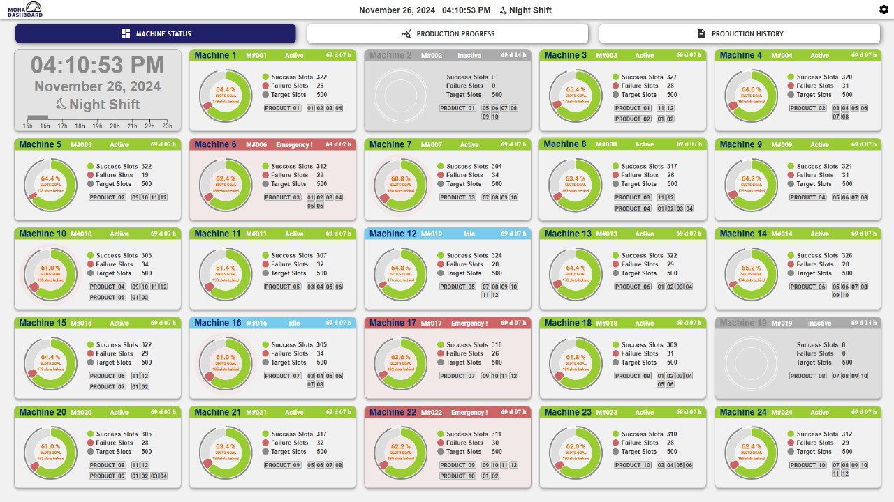
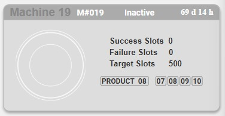
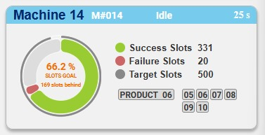
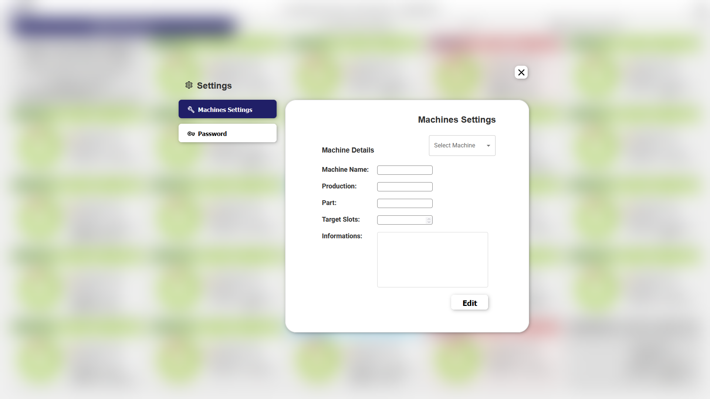

[comment]: # "This is the standard layout for the project, but you can clean this and use your own template"

# **MONA Dashboard**

---

<!--
This is a sample image, to show how to add images to your page. To learn more options, please refer [this](https://projects.ce.pdn.ac.lk/docs/faq/how-to-add-an-image/)
 -->

## Table of Contents

1. [Overview](#Overview)
2. [Key Features](#Key-Features)
3. [Software Architecture](#Software-Architecture)
4. [Team](#Team)
5. [Links](#links)

---

## **Overview**

Our project focuses on developing an advanced real-time monitoring dashboard tailored for a production environment. This dashboard aims to enhance the efficiency and reliability of production processes by providing critical insights and timely alerts. Our system is designed with user-friendliness, ensuring that operators and managers can easily access and interpret the data they need to maintain optimal production performance.

## **Key Features**

#### Real-Time Monitoring of Mold Machines:
##### ***Particle Detection and Alerts:***
The dashboard includes a dedicated tab for monitoring mold machines. It provides real-time detection of particles stuck in the molds, an issue that can significantly impact production quality and efficiency. When particles are detected, the system immediately triggers alerts, allowing for prompt intervention and minimizing downtime.

#### Production Rate Monitoring:
##### ***Live Production Metrics:***
Another tab is devoted to displaying the current production rates of various machines. This feature enables users to track and analyze the performance of each machine in real time. By continuously monitoring production rates, the dashboard helps identify bottlenecks, underperforming machines, and opportunities for process improvements.

#### Historical Production Data:
##### ***Comprehensive Production History:***
The third tab provides access to a detailed history of production activities. Users can review past performance data, analyze trends, and generate reports. This historical perspective is crucial for long-term planning, quality control, and identifying recurring issues needing strategic solutions.

## **Software Architecture**

## **Dashboard Views**

#### ***Machine Status Page View***

#### **Expanding the Dashboard Views**

***Active Machine Status***-
Machine is working perfectly!

***Emergency Machine Status***-
There is a stuck particle in the machine.

***Inactive Machine Status***-
Machine is OFF.

***Idle Machine Status***-
Machine is ON but not making products.

#### ***Production Rate Page View***

#### ***Production Summary Page View***

#### ***Setting Page View***

User can change the password and machine details by verifying the password as desired.

## **Team**

- E/20/361, Yohan Senadheera, [e20361@eng.pdn.ac.lk](mailto:e20361@eng.pdn.ac.lk)
- E/20/378, Amanda Siriwardhane, [e20378@eng.pdn.ac.lk](mailto:e20378@eng.pdn.ac.lk)
- E/20/366, Bhagya Senevirathna, [e20366@eng.pdn.ac.lk](mailto:e20366@eng.pdn.ac.lk)
- E/20/024, Buddhika Ariyarathna , [e20024@engdn.ac.lk](mailto:e20024@eng.pdn.ac.lk)
- E/20/089, Yasiru Harinda, [e20089@engdn.ac.lk](mailto:e20089@eng.pdn.ac.lk)

## **Links**
- [Project Repository](https://github.com/cepdnaclk/{{ page.repository-name }}){:target="\_blank"}
- [Project Page](https://cepdnaclk.github.io/{{ page.repository-name}}){:target="\_blank"}
- [Department of Computer Engineering](http://www.ce.pdn.ac.lk/)
- [University of Peradeniya](https://eng.pdn.ac.lk/)

[//]: # "Please refer this to learn more about Markdown syntax"
[//]: # "https://github.com/adam-p/markdown-here/wiki/Markdown-Cheatsheet"
